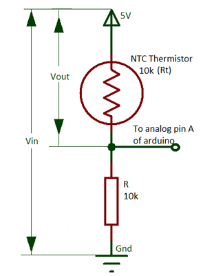

# Thermistor
Negative Temperature Coeficient Thermistor

The current library is build based on an NTC thermistor with the following 
characteristics: 

- Stainless steel sheath and waterproof
- Measurement range: -20 to 105 °C
- Length of wire: 1 meter
- Size of probe: 5 x 25 mm
- Output: 2 wires
- Type: NTC 10k±1% 3950
- measure environmental temperatures using with FOR arduino ADC and this 
10k NTC LINK
- Resistance to temperature conversion table LINK
- B-constant : 3380K -/+ 1%
- Typical Dissipation Constant 5mW/ °C
- Probe insulation: >100MOhm
- Peak Voltage sustain time: 2 seconds, AC1800V 1mA 2 seconds
- Stress sustain: 9.8N (1kgF) for 1 minute no deformation

However, the library can be used for different NTC thermistor. It is just 
required to set the `B` parameter and the reference temperature of the sensor 
correctly.

# Docs

Some useful data are available in the docs folder of the current repos.

# How to use it?

The usage of this library is showcase in the example folder. The main functions 
availables are:

- `Thermistor(uint8_t pin)`: constructor. The parameter `pin` is the number of 
the analog pin the sensor is connected to.
- `void read(uint8_t unit = DEG_C)`: to read a measurement from the sensor. If 
no `unit` parameter provided, the temperature is returned by default in degre 
celcius (`°C`)
- `void setB(float value)`: used to set the `B` parameter of the NTC sensor
- `void setADCReferenceVoltage(float value)`: to set the ADC Vref config. By 
default, Vref is set to `5.0V`.
- `void setReferenceTemperature(float value)`: set the reference temperature of 
the sensor

``` 
    // unit definitions
    #define DEG_C   0       // degree celcius
    #define DEG_K   1       // degree Kelvin
    #define DEG_F   2       // degree Fahrenheit

    // read temperature in degree Kelin (by example)
    float temperature = sensor.read(DEG_K);
```

# Connection

The sensor should be wired according to the circuit below




